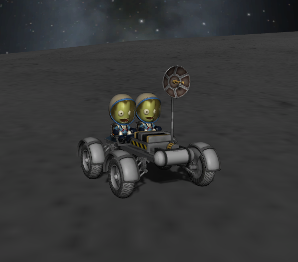
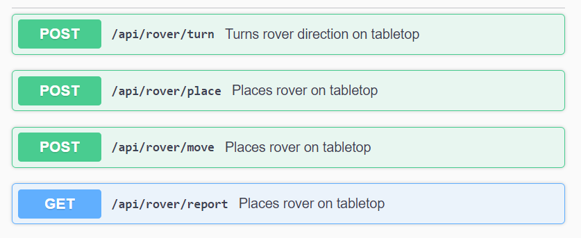
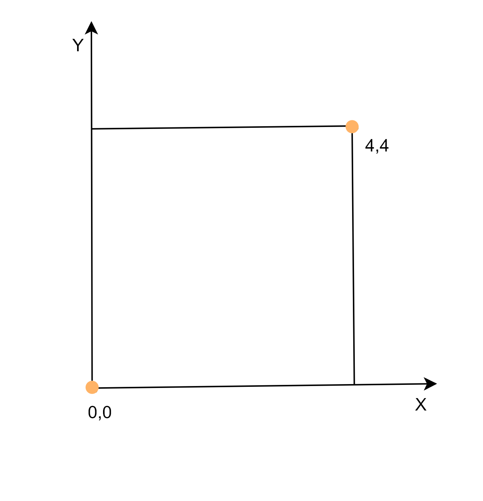
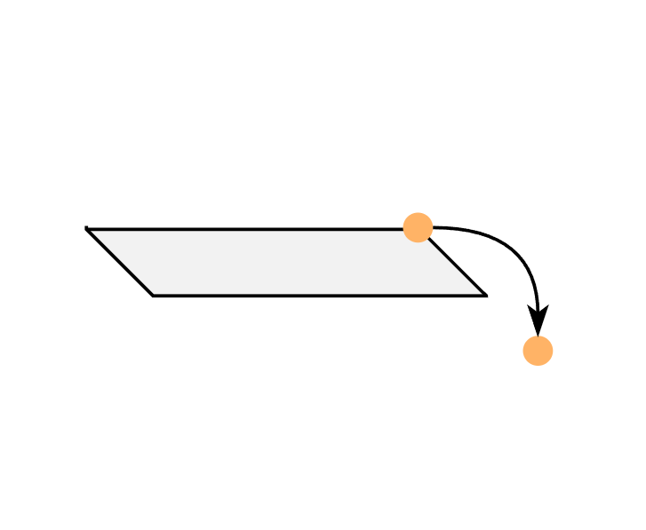
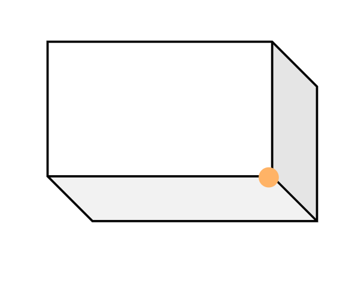

## an ICE coding challenge
The purpose of this application is to guide a rover 
over a small area defined in the configuration application.properties

## REST API
 To facilitate this there are 4 main API calls:

## CONCEPT

    The tabletop is defined as an 2D array of tabletop objects of 
    wich the rover is the extended class and the tabletop has
    x and y dimensions begining from 0,0 coordinates

    To handle the rover going outside the bounds of the tabletop
    there exist two possible  concepts to handle that case.
    In the first instance we could determine that the new coordinates are outside
    the dimensions of the tabletop and throw an error.

    In the second instance we might bound the movement so that the rover simply 
    stays in place as if the rover where pushing into a wall where it is not able to 
    move forward. We might describe that concept as if the rover and the tabletop where 
    in a box.

