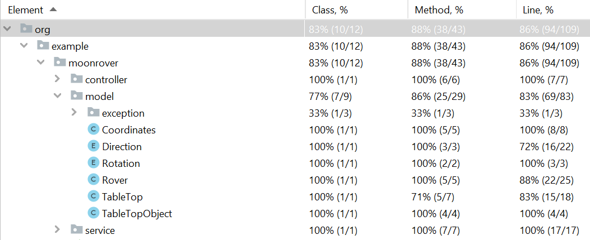

## ICE coding challenge

There are two parts:
- the implementation is located in in the src folder;
- the corresponding presentation is located in the presentation folder.

## REST API
The task at hand requires 4 main API calls:

The methodologies and reasoning of the implementation 
is explained in more detail in the presentation (e.g. error handling).

## Code Coverage
The solution also includes integration tests that verify and document the usage of the application.  
The level of the coverage is the following: 

